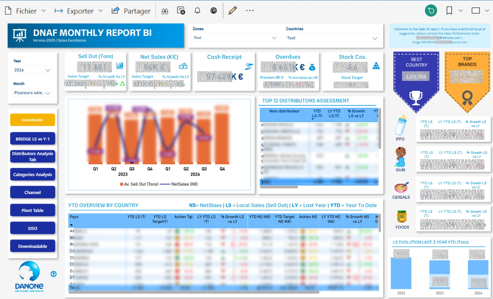
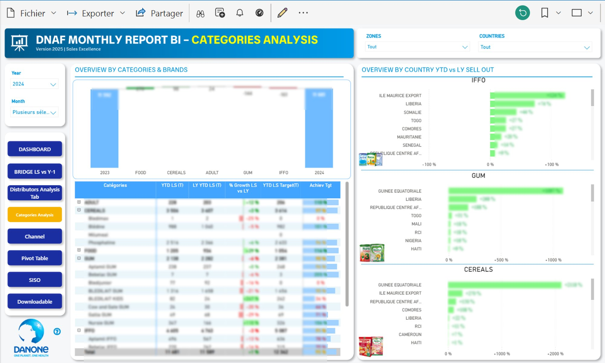
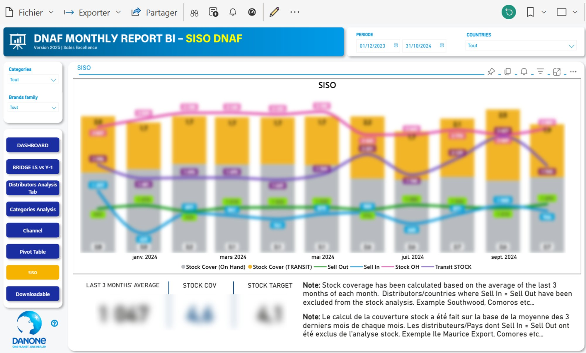

# 🔷 DNAF Monthly Report BI — Power BI Dashboard

> A multi-page interactive Power BI report built to monitor **~€120M in commercial performance** across **15+ Sub-Saharan African markets**, **70+ distributors**, and **100+ SKUs** — serving **200+ stakeholders** across 6 departments at Danone Sub-Saharan Africa.

---

## 🧠 Business Context

Built and operated during my role as **Senior Commercial Performance & BI Analyst at Danone Sub-Saharan Africa**.

This Power BI report was the **interactive, cloud-published layer** of the commercial analytics ecosystem, feeding from the same data pipeline as the [Excel BI Dashboard](https://github.com/sergenguena1/excel-commercial-bi-dashboard) but adding deeper interactivity, SKU-level granularity, channel analysis, and a self-service database download feature for advanced users.

**Key differentiators vs Excel dashboard:**
- Analysis down to individual **SKU level** (100+ SKUs)
- **Distribution channel breakdown** (Proxy, Pharma, Modern Trade)
- **6-year historical depth** for trend analysis
- **Self-service data export** — users can download the full database to build their own pivot tables
- Published on **Power BI Service** for real-time cloud access by 200+ stakeholders

**Departments served:** Commercial · Marketing · Supply Chain · Healthcare · Finance · HR

---

## 🗂️ Report Structure — 8 Pages

### 1. 📊 Dashboard — Executive Command Center

The main landing page consolidating all key commercial KPIs: Sell Out (Tons), Net Sales (K€), Cash Receipt, Overdues, and Stock Coverage vs target and prior year. Features an interactive country and zone selector, quarterly Sell Out vs Net Sales combo chart over 2 years, Top 12 Distributors Assessment table, YTD Overview by Country matrix, and brand-level scorecards (IFFO, GUM, Cereals, Foods) with 3-year YTD evolution. "Best Country" and "Top Brands" award visuals for instant performance recognition.

---

### 2. 🌉 Bridge LS vs Y-1 — Zone & Country Waterfall

Waterfall chart decomposing YTD Local Sales performance vs prior year by zone (Savannah, Atlantic, Southern, Tropical, FGS, Satellites, Indian Ocean) and by country within each zone. Includes KPI summary cards and filterable by Categories and Family Brands. Enables instant identification of which zones and markets are driving or dragging overall growth.

---

### 3. 🏪 Distributors Analysis — Partner Performance Deep Dive

Dual bridge view (Sell Out by Partners and Net Sales by Partners) combined with a granular country × distributor matrix showing YTD LS, LY YTD, % Growth, YTD NS, LY YTD NS, % Growth NS, YTD Target NS, and Achievement %. Includes Top 5 Partners by weight ranking. Enables identification of underperforming or at-risk distributor relationships at country level.

---

### 4. 📦 Categories Analysis — Brand & SKU Performance

Category and brand-level bridge chart with full matrix breakdown (YTD LS, LY YTD LS, % Growth, YTD LS Target, Achievement %) across all categories (Adult, Cereals, Food, GUM, IFFO) and sub-brands (Aptamil, Bebelac, Blédilait, Nursie, Gallia, Cow & Gate, Phosphatine, Blédine, etc.). Complemented by an "Overview by Country YTD vs LY Sell Out" bar chart panel per category for immediate geographic performance reading.

---

### 5. 🛒 Channel Sell Out Analysis — Distribution Channel View

Unique analysis of Sell Out performance broken down by distribution channel (Proxy, Pharma, Modern Trade) across product categories (IFFO, Cereals, GUM) over 3 years. Enables Commercial and Marketing teams to track channel shift dynamics and identify which distribution routes are gaining or losing share by category.

---

### 6. 📋 Pivot Table — Flexible Zone × Category Matrix

Dual interactive matrix combining a Zone × Distributor breakdown (YTD LS, LY YTD LS, % Growth vs LY) with a Category × Sub-brand breakdown in a single view. Completed by a "Trend Last 2 Years" Sell Out vs Sell In line chart covering 24 months (January 2022 – December 2024). Filterable by Zones/Countries/Partners and Cat/Brands/SKU for maximum flexibility.

---

### 7. 📈 SISO DNAF — Stock Intelligence Dashboard

Dedicated SISO (Sell-In / Sell-Out) tracking page showing monthly Sell In, Sell Out, Stock OH, Transit Stock, Stock Cover (On Hand) and Stock Cover (Transit) simultaneously over 10 months on a single combo chart. KPI summary cards for Last 3 Months Average, Stock COV, and Stock Target with bilingual methodology notes for field teams. Filterable by Period, Countries, Categories and Brands family.

---

### 8. ⬇️ Download Our Database — Self-Service Data Export

A self-service data page enabling advanced users to download the full granular database directly from Power BI. The database includes Zone, Country, Distributor, SKU, Forecast Description, Brand, Family, Category, Channel, City, Year, Month, Unit, and Sell Out columns — allowing stakeholders to build their own pivot tables and custom analyses in Excel or other tools.

---

## ⚙️ Technical Highlights

| Feature | Detail |
|---|---|
| **Platform** | Power BI Desktop + Power BI Service (cloud-published) |
| **Data granularity** | SKU × Distributor × Channel × Country × Month |
| **Historical depth** | 6 years of sell-out history |
| **DAX measures** | YTD, LY YTD, % Growth, Achievement %, Stock Coverage, Waterfall bridge |
| **Power Query** | Data transformation, normalization, and distributor file consolidation |
| **Interactivity** | Cross-filtering across all pages via Zones, Countries, Categories, Brands, Period slicers |
| **Self-service layer** | Full database download page for advanced users |
| **Data pipeline** | Fed by the same VBA ETL pipeline as the Excel dashboard (see [excel-vba-etl-multifile-compiler](https://github.com/sergenguena1/excel-vba-etl-multifile-compiler)) |

---

## 📈 Business Impact

| Metric | Result |
|---|---|
| Revenue scope monitored | ~€120M |
| Markets covered | 15+ Sub-Saharan African countries |
| Distributors tracked | 70+ |
| SKUs monitored | 100+ |
| Historical depth | 6 years |
| Stakeholders served | 200+ across 6 departments |
| Reporting delivery | From the 22nd → **2nd of the month** |
| Trade spend overspend | Reduced from +30% → **–5%** over 3 years |

---

## 🔗 Related Projects

- **[Excel Commercial BI Dashboard](https://github.com/sergenguena1/excel-commercial-bi-dashboard)** — The Excel counterpart: 8-tab dashboard for the same commercial scope
- **[VBA ETL Multi-File Compiler](https://github.com/sergenguena1/excel-vba-etl-multifile-compiler)** — The automated pipeline that feeds both dashboards (processes 70+ distributor files in under 4 minutes)

---

## 👤 Author

**Serge NGUENA** — Senior Commercial Performance & BI Analyst  
[LinkedIn](https://linkedin.com/in/serge-nguena) · Laval, QC · Permanent Resident

---

## 📄 Note on Data

All figures visible in the screenshots have been anonymized. No raw data files are published in this repository.
